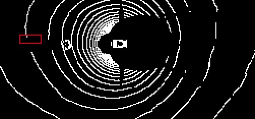
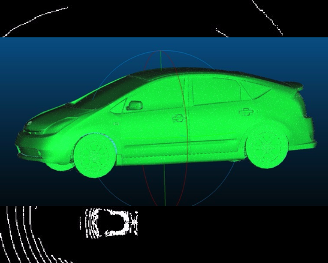
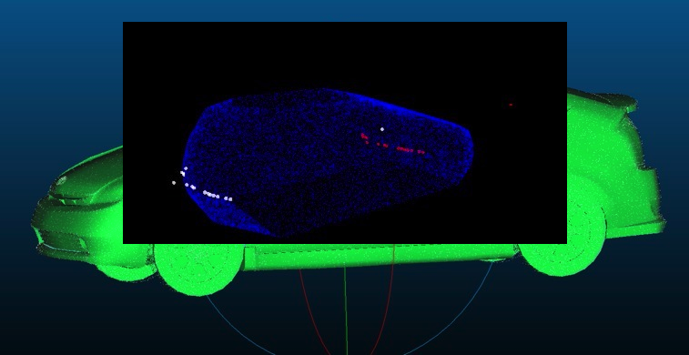
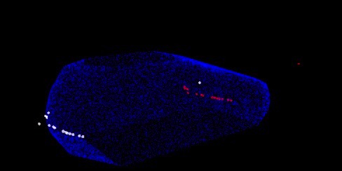
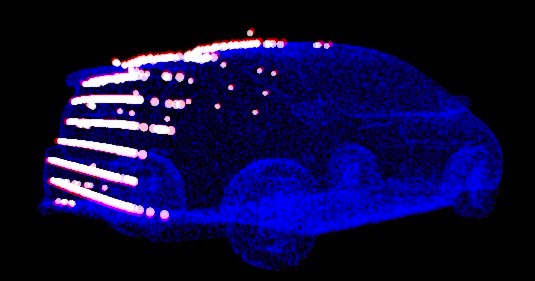
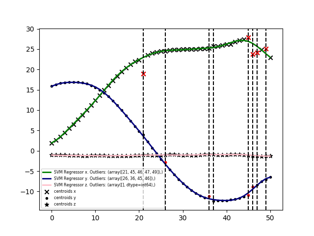

## TORBUS Team: *Round 1 entry for DIDI/Udacity Competition*

This is a summary of the work done for Didi / Udacity competition for round 1.

### Installation

For training and ground truth refining, install TensorFlow, h5py, Keras. The code has been tested with TensorFlow 1.1.0, Keras 2.0.4, CUDA 8.0 and cuDNN 5.1 on Ubuntu 14.06.

To run the `bad_predict.py` script also need to have the ROS environment setup, e.g. by running `. /opt/ros/indigo/setup.bash` and have the dependencies above met.

### Overall approach

The solution for this round consists of a lidar-only regressor that takes lidar frames in and predicts position and size of the centroid of the obstacle vehicle.

For round 1 we wanted to focus on polishing the ground truth and getting familiar with ROS and LIDAR, as well as designing a (deep) neural network for this problem. Once we get this working, the full pipeline will be something like this:

When an object is detected, track is state (`x,y,z,sx,sy,sz,yaw`) using a Kalman filter with the following inputs:

- Vehicle detector: performs classification (is there a vehile in the lidar frame?) and regression (where is it?)
- Radar fusion: take the closest beam as reported by `/radar/tracks` 

### Compromises made for round #1

The most difficult part of the pipeline is to build a real-time detector based on lidar data. The solution submitted in round #1 only consists of a lidar-based regressor that given a lidar frame return the position `tx,ty,tz` and size `sx,sy,sz`, making the assumption that there's *always* an obstacle; hence the low score achieved (we did not check for false positives in round #1).

Our focus has been to make sure this component runs in real time. *On a 1080 GTX GPU the lidar-based regressor **takes ~15 msecs** to run*.

Technically, we built a neural network based on Pointnet as described in [arXiv tech report](https://arxiv.org/abs/1612.00593), which is going to appear in CVPR 2017. Pointcloud consists of novel deep net architecture for point clouds (as unordered point sets). Check [project webpage](http://stanford.edu/~rqi/pointnet) for a deeper introduction.

### Ground truth refining

The ground truth provided by the competition organizers consists of bag files recorded from the capture vehicle and GPS/RTK frames of the obstacle vehicle. In addition, the competition organizers provided scripts to generate tracklet files inspired (but not sematically identical) to KITTI tracklet files.

There were some issues with the ground truth:
* It does not account for obstacle orientation (yaw)

* Sync issues: tracked obstacle does not match its location in many frames, e.g.:

* Frame reference: tracklet files are generated for the camera framerate, and we'll need them in the lidar framerate.

#### Step 1: Lidar-referenced tracklets and yaw estimation.

We modified the `generate_tracklet.py` script to:
* Correct sync issues by using alternative timestamps for the obstacle RTK messages.
* Detect obstacle yaw if the obstacle moves by approximating its trajectory. There are bag files in which the obstacle does not move, which we'll fix in step 2.

#### Step 2: Pose and alignment fine-tuning

There's a lot of frames where the (`tx,tx,tz`) values are not properly aligned with the obstacle pose. Since we can visually inspect the cars used as obstacles, we modeled them as point clouds (convex hull approximations) and build a custom RANSAC pose-alignment to fine-tune alignment in (tx,ty) coordinates and placing them exactly over the ground plane (tz). This fixes all issues with pitch/roll lidar misalignment.

Here's the 3d model of one of the obstacle vehicles:

And here's the RANSAC pose alignment fixing the misaligned position (red) and the resulting, aligned match (white):

The process is governed by the `refine.py` script under `didi-competion/tracklets/python`. 

#### Step 3: Outlier removal

In some cases RANSAC refined on a specific frame results in a not perfect alignment. We build an outlier detector on a per-bag basis using the obstacle trajectory to automatically remove frames where the obstacle position deviates from the predicted trajectory:

### Bag prediction

The code in `bag_prediction.py` is not a ROS node but parses a bag file secuentially and listens to the lidar point clould messages, calculates the obstacle pose and size and for each timestamp of incoming video frame, generates a pose using the last known position. This naïve approach got us to ~1% score and since round #1 is qualifying only and we believe we qualify already, we've started work on an completely revampted pipeline for round two.

STAY TUNED
